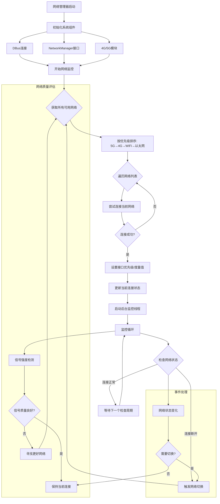

# network_switch-for-robot
针对树莓派机器人，自动根据网络环境进行异构网络切换，包括wifi、4G/5G等
以下是根据树莓派5智能网络连接管理器的实现思路梳理的详细流程图：

## 流程图关键节点说明

### 1. 系统初始化阶段
- **初始化组件**：建立与DBus、NetworkManager和4G/5G模块的连接
- **配置优先级**：设定网络类型优先级（5G > 4G > WiFi > 以太网）

### 2. 网络选择与连接阶段
- **网络发现**：扫描所有可用网络连接
- **智能排序**：按预设优先级对网络进行排序
- **连接尝试**：按优先级顺序尝试建立连接
- **优先级设置**：为成功连接的网络设置路由度量值

### 3. 持续监控阶段
- **状态检查**：定期验证当前网络连接状态
- **质量评估**：监控信号强度、延迟等质量指标
- **自动切换**：在检测到网络断开或质量下降时触发重新连接

### 4. 事件响应机制
- **网络状态变化**：实时响应网络连接状态变化
- **智能决策**：基于预设规则决定是否需要切换网络

## 核心功能模块

1. **连接管理器** (`RaspberryPiNetworkManager`)
   - 负责网络连接的建立、维护和切换
   - 与系统NetworkManager进行DBus通信

2. **优先级引擎**
   - 定义网络类型优先级
   - 计算最佳可用网络

3. **监控守护进程**
   - 后台持续监控网络状态
   - 触发自动切换逻辑

4. **蜂窝网络模块** (`CellularModuleManager`)
   - 管理4G/5G模块的初始化和配置
   - 处理AT指令通信

这个流程图清晰地展示了树莓派网络管理器的完整工作流程，从系统初始化到持续的网络监控和自动切换，确保设备始终保持在最佳的网络连接状态。
